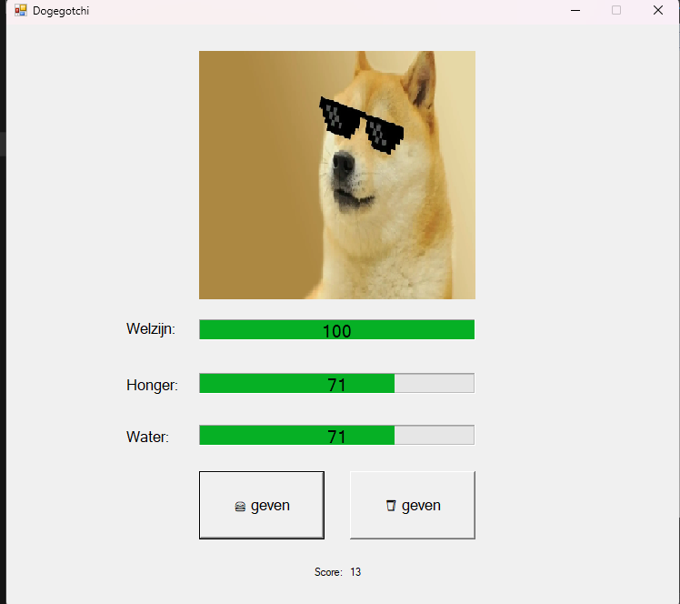

# ***Tamagotchi***

#
<h2>Omschrijving</h2>

<p1>Dit is een werkende Tamagotchi gemaakt met C#.<p1>  
  <p2>Elke 1 seconden gaat er bij honger en water 1 punt weg.</p2> 
  <p3> Als een van de onderste bars 0 raakt dan gaat de telt de welzijn bar af. Als die nul raakt dan is het Game Over. </p3>
